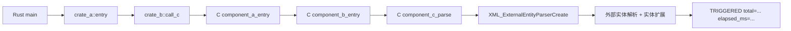
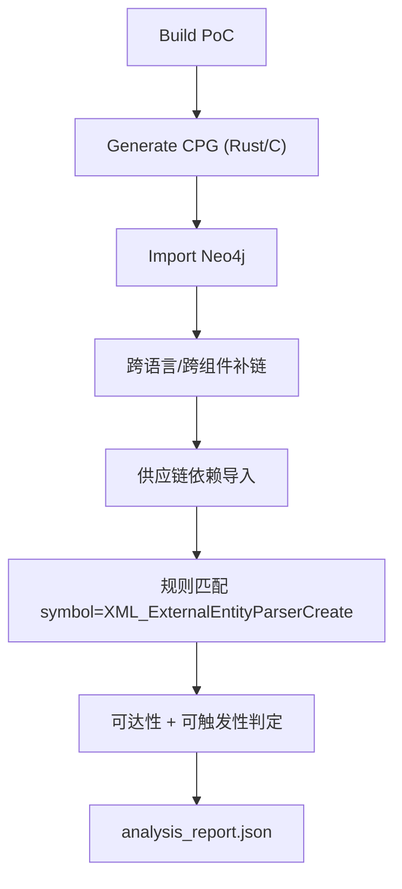

# CVE-2024-28757 跨语言多层间接调用 PoC 说明

## 1. 漏洞概述

- 漏洞编号: `CVE-2024-28757`
- 组件: `libexpat`
- 影响版本: `< 2.6.2`
- 漏洞类型: XML 实体扩展导致的拒绝服务（DoS）
- 关键危险函数: `XML_ExternalEntityParserCreate`

该漏洞发生在外部实体解析路径中。当程序对攻击者可控 XML 启用了外部实体解析，并在该路径上触发实体递归扩展时，会导致显著的 CPU/内存消耗。

## 2. PoC 设计目标

本 PoC 明确验证以下条件：

- Rust 代码不是直接调用漏洞函数，而是通过多层 C 组件间接触发。
- 调用链跨语言且跨组件。
- 触发效果可观测、可复现、可用于自动检测。

## 3. 代码结构

### 3.1 C 多层链路

- `/Users/dingyanwen/Desktop/RUST_IR/cpg_generator_export/examples/c/cve_2024_28757_chain/component_a.c`
- `/Users/dingyanwen/Desktop/RUST_IR/cpg_generator_export/examples/c/cve_2024_28757_chain/component_b.c`
- `/Users/dingyanwen/Desktop/RUST_IR/cpg_generator_export/examples/c/cve_2024_28757_chain/component_c.c`

调用关系:

`component_a_entry -> component_b_entry -> component_c_parse -> XML_ExternalEntityParserCreate`

### 3.2 Rust 调用链

- `/Users/dingyanwen/Desktop/RUST_IR/cpg_generator_export/examples/rust/cve_2024_28757_chain_app/app/src/main.rs`
- `/Users/dingyanwen/Desktop/RUST_IR/cpg_generator_export/examples/rust/cve_2024_28757_chain_app/crate_a/src/lib.rs`
- `/Users/dingyanwen/Desktop/RUST_IR/cpg_generator_export/examples/rust/cve_2024_28757_chain_app/crate_b/src/lib.rs`

调用关系:

`main -> crate_a::entry -> crate_b::call_c -> component_a_entry`

### 3.3 漏洞规则与依赖图配置

- 漏洞规则: `/Users/dingyanwen/Desktop/RUST_IR/cpg_generator_export/tools/supplychain/supplychain_vulns_cve_2024_28757.json`
- 供应链补充: `/Users/dingyanwen/Desktop/RUST_IR/cpg_generator_export/tools/supplychain/supplychain_extras_cve_2024_28757.json`

## 4. 流程图

### 4.1 运行时触发路径



### 4.2 分析流水线



## 5. 运行与验证

### 5.1 仅触发 PoC

```bash
zsh /Users/dingyanwen/Desktop/RUST_IR/cpg_generator_export/tools/pipeline/build_cve_2024_28757_chain.sh
export LD_LIBRARY_PATH="/Users/dingyanwen/Desktop/RUST_IR/cpg_generator_export/output/cve_2024_28757/bin:/Users/dingyanwen/Desktop/RUST_IR/cpg_generator_export/vendor/so/expat-2.6.1/install/lib:$LD_LIBRARY_PATH"
/Users/dingyanwen/Desktop/RUST_IR/cpg_generator_export/examples/rust/cve_2024_28757_chain_app/target/debug/app
```

触发成功输出示例:

```text
[+] C chain result: TRIGGERED total=600000 elapsed_ms=12
[+] CVE-2024-28757 trigger confirmed via Rust -> C -> C -> C -> expat
```

### 5.2 跑完整检测

```bash
zsh /Users/dingyanwen/Desktop/RUST_IR/cpg_generator_export/tools/pipeline/run_cve_2024_28757_chain.sh
```

结果文件:

- `/Users/dingyanwen/Desktop/RUST_IR/cpg_generator_export/output/cve_2024_28757/analysis_report.json`

本次实测关键字段:

- `reachable: true`
- `triggerable: "confirmed"`
- 依赖链: `app -> crate_a -> crate_b -> compa -> compb -> compc -> expat`
- 调用链终点: `XML_ExternalEntityParserCreate`

## 6. 为什么该 PoC 满足“多层间接调用”

- Rust 层并未直接调用漏洞函数。
- C 层存在 3 级组件跳转（A/B/C）。
- 危险函数位于最深层组件，且仍可从 Rust 输入到达。

这对应真实供应链风险模式: 上层业务代码调用自研或第三方封装层，封装层再间接触达脆弱底层组件。

## 7. 当前实现要点

- 为 Rust 多 crate 场景分别生成 CPG 并导入，避免只分析 `main.rs` 导致链路断裂。
- 在导图后执行补链脚本：
  - `patch_missing_calls.py`
  - `link_rust_calls.py`
  - `link_callbacks.py`
  - `link_cpgs.py`
- 供应链依赖采用“Cargo + 明确 C 组件链”组合，保证 `DEPENDS_ON` 可解释。

## 8. 已知限制与改进方向

- `auto_extras.py` 在 macOS `.dylib` 命名与递归依赖识别上仍需继续完善，当前本 PoC 使用静态 extras 保证链路稳定。
- 触发性判定当前偏调用链证据，后续可增加跨语言数据流约束以进一步降低误报。
- 若运行环境中 `python3` 无 `neo4j` 模块，可用 `PYTHON_BIN=python` 运行分析脚本。
