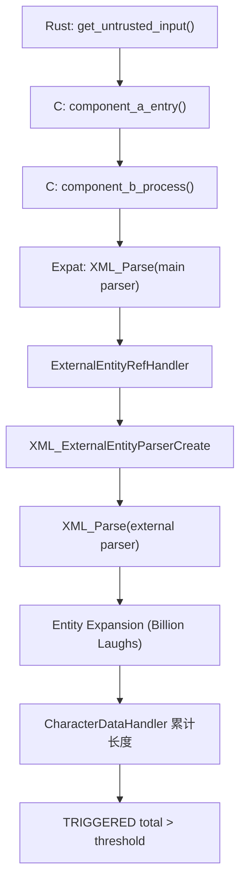
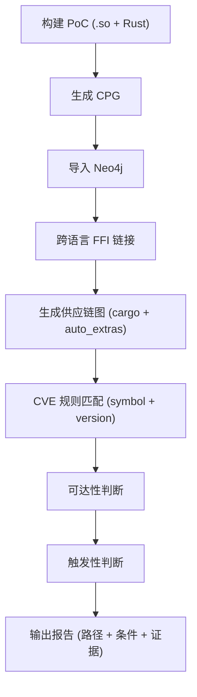

# 跨语言供应链漏洞可达/可触发检测说明（CVE-2024-28757 / libexpat）

本文档基于当前项目代码与已跑通的 PoC 结果整理，面向“立项/开题/技术路线”用途，重点解释漏洞原理、检测流程、创新点、难点、不足与未来计划，并配图。

## 1. 漏洞概览（面向非 XML 背景）

### 1.1 XML 与实体（Entity）基础
- XML 是一种结构化文本格式，例如：`<root><name>Alice</name></root>`。
- 实体（Entity）类似“宏替换”，先定义再引用：
  - `<!ENTITY hi "hello">` 定义实体
  - `&hi;` 使用实体
- 外部实体（External Entity）实体内容来自外部资源：
  - `<!ENTITY ext SYSTEM "http://example.com/evil">`
  - 解析到 `&ext;` 时会触发外部实体解析流程。

### 1.2 漏洞类型
- CVE-2024-28757 属于“实体膨胀（Entity Expansion）导致的 DoS”。
- 攻击者构造“Billion Laughs”式递归实体扩展，解析时消耗大量 CPU/内存。

### 1.3 触发条件（关键点）
- 关键 API：`XML_ExternalEntityParserCreate`。
- 当使用“外部实体解析器”解析攻击者可控 XML 时，expat 2.6.1 及以下版本未正确限制扩展，导致指数级膨胀。
- 结果：资源耗尽（DoS）。

## 2. 本项目 PoC 的真实触发路径

### 2.1 代码入口与链路
- Rust 入口：`/Users/dingyanwen/Desktop/RUST_IR/cpg_generator_export/examples/rust/indirect_expat_app/app/src/main.rs`
- Rust→C FFI：`/Users/dingyanwen/Desktop/RUST_IR/cpg_generator_export/examples/rust/indirect_expat_app/crate_b/src/lib.rs`
- C 组件 A：`/Users/dingyanwen/Desktop/RUST_IR/cpg_generator_export/examples/c/indirect_expat/component_a.c`
- C 组件 B（触发点）：`/Users/dingyanwen/Desktop/RUST_IR/cpg_generator_export/examples/c/indirect_expat/component_b.c`
- 依赖库：`libexpat`（2.6.1）

### 2.2 触发效果（可见证据）
- C 侧对外部实体解析结果累计长度，超过阈值打印：`TRIGGERED total=...`。
- Rust 侧输出：`[+] Vulnerability triggered (entity expansion)`。

### 2.3 触发流程图（解析器内部）

## 3. 检测流程（可达 + 可触发）

### 3.1 构建与依赖补全
- C/.so 依赖自动补全脚本：
  - `/Users/dingyanwen/Desktop/RUST_IR/cpg_generator_export/tools/supplychain/auto_extras.py`
- 解析内容：
  - `build.rs` 中的 `cargo:rustc-link-lib` 与 `cargo:rustc-link-search`
  - `.so/.dylib` 二进制依赖（`otool -L` / `ldd`）
  - 自动推断版本号（路径 / pkg-config / SONAME）

### 3.2 CPG 生成与导入
- Rust CPG：`/Users/dingyanwen/Desktop/RUST_IR/cpg_generator_export/generate_cpgs.sh`
- C CPG：Joern → GraphML → JSON
- Neo4j 导入：
  - `/Users/dingyanwen/Desktop/RUST_IR/cpg_generator_export/tools/neo4j/import_cpg.py`
- 跨语言连接（FFI）：
  - `/Users/dingyanwen/Desktop/RUST_IR/cpg_generator_export/tools/neo4j/link_cpgs.py`

### 3.3 供应链图与漏洞规则
- 供应链分析脚本：
  - `/Users/dingyanwen/Desktop/RUST_IR/cpg_generator_export/tools/supplychain/supplychain_analyze.py`
- CVE 规则：
  - `/Users/dingyanwen/Desktop/RUST_IR/cpg_generator_export/tools/supplychain/supplychain_vulns_expat.json`
- 输出：
  - `/Users/dingyanwen/Desktop/RUST_IR/cpg_generator_export/output/analysis_report_expat.json`

### 3.4 检测流程图（CPG + 供应链融合）

## 4. 创新点
- 跨语言 CPG 统一建模（Rust + C）并显式连通 FFI 调用链。
- 供应链依赖链 + 调用链双条件判定“可达”。
- 触发性分析包含“源/净化”规则，输出条件与证据。
- C/.so 依赖自动化补全，降低手工维护成本。

## 5. 难点与当前不足

### 5.1 为什么有时 `triggerable = unknown`
当前 `supplychain_analyze.py` 的触发性判断逻辑只在 **Rust 调用节点**上寻找 `USES_SYMBOL` 关系，即：
- 触发性分析入口是 `CALL:Rust -[:USES_SYMBOL]-> SYMBOL`。
- 当漏洞符号只在 C 内部调用（如 `XML_ExternalEntityParserCreate` 在 `component_b.c` 中调用）时，Rust 调用链无法直接绑定该 symbol。
- 因此可达性为 true，但触发性只能返回 unknown。

对应现象：
- `/Users/dingyanwen/Desktop/RUST_IR/cpg_generator_export/output/expat_analysis/analysis_report.json` 中出现：
  - `reachable: true`
  - `triggerable: "unknown"`

### 5.2 其它不足
- 触发性依赖规则匹配，缺少跨语言数据流/污点传播。
- `.so` 版本推断仍依赖路径习惯或 pkg-config，仍可能不稳定。
- 供应链图对非 Cargo/非 build.rs 构建体系的兼容性不足。

## 6. 当前问题的可落地解决方向

### 6.1 触发性判定升级（建议）
- 在 `analyze_triggerability` 中补充 **C 侧 CALL 触发判断**：
  - 允许 `CALL:C -[:USES_SYMBOL]-> SYMBOL` 触发
  - 沿 `FFI_CALL` 反向回溯 Rust 方法，寻找 source/sanitizer
- 或：只要 `call_chain` 存在且 Rust 侧 source 命中即可给出 `possible`。

### 6.2 数据流增强
- 在 Rust → C 调用链上引入轻量数据流跟踪。
- 对跨语言参数做 taint 传播，提高“可触发性”精度。

## 7. 未来工作计划

### 阶段 1：完善触发性推断
- 支持 C 侧 symbol 触发回溯
- 增强 source/sanitizer 匹配
- 输出完整触发证据链（跨语言）

### 阶段 2：构建层依赖自动化
- build.rs 之外构建体系解析（Make/CMake/pkg-config）
- 二进制依赖扫描与版本推断完善

### 阶段 3：数据流与条件建模
- 引入轻量污点分析
- 引入配置/宏/编译选项条件约束

### 阶段 4：多语言扩展
- Python / Java / Go 原生扩展依赖链
- 跨语言符号对齐与规则库扩展

## 8. 运行结果与验证路径
- 触发输出：
  - Rust 运行输出中出现 `TRIGGERED` 与 “Vulnerability triggered”。
- 报告文件：
  - `/Users/dingyanwen/Desktop/RUST_IR/cpg_generator_export/output/analysis_report_expat.json`
  - `/Users/dingyanwen/Desktop/RUST_IR/cpg_generator_export/output/expat_analysis/analysis_report.json`

---

如需我把“触发性 = unknown”的原因修复为可自动判断，请直接说“修复触发性判定”，我会在 `supplychain_analyze.py` 中补充 C 侧 symbol 回溯逻辑。
