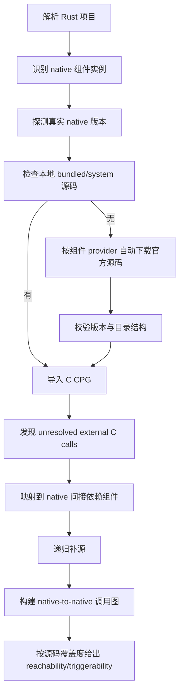

# Native 组件自动补源与递归源码分析设计

## 1. 目标

当前工具已经具备：

- Rust 项目依赖解析
- native 组件版本解析
- 缺少 C body 时按 symbol 触发补源
- 补源后导入 C CPG 并继续分析

但离目标还有明显差距。目标应明确为两条：

1. 当项目通过动态链接或 system library 使用 native 组件，且项目本地没有该组件源码时，工具应自动下载与项目实际使用版本对齐的官方源码，再继续构图分析。
2. 当 native 组件内部还调用其他 native 组件时，工具应继续递归补源，构建 native-to-native 调用图；在未补齐关键源码前，不应给出过强结论。

本文档给出针对当前代码结构的具体设计。

## 2. 当前状态与缺口

### 2.1 已有能力

- 组件版本探测：`system` 场景下可通过 `pkg-config` / 专用 config / CLI 探测版本，见 [supplychain_analyze.py](/Users/dingyanwen/Desktop/RUST_IR/cpg_generator_export/tools/supplychain/supplychain_analyze.py#L886)。
- 缺源码补源入口：当 symbol 没有 `METHOD:C` 且 `source_status in {stub,binary-only,system}` 时触发补源，见 [supplychain_analyze.py](/Users/dingyanwen/Desktop/RUST_IR/cpg_generator_export/tools/supplychain/supplychain_analyze.py#L4657)。
- 补源后导入 C 图：见 [supplychain_analyze.py](/Users/dingyanwen/Desktop/RUST_IR/cpg_generator_export/tools/supplychain/supplychain_analyze.py#L523)。
- 本地 bundled 源码发现与少量官方下载：见 [native_source_resolver.py](/Users/dingyanwen/Desktop/RUST_IR/cpg_generator_export/tools/fetch/native_source_resolver.py#L76) 和 [native_source_resolver.py](/Users/dingyanwen/Desktop/RUST_IR/cpg_generator_export/tools/fetch/native_source_resolver.py#L158)。

### 2.2 当前不满足的点

1. 官方下载只支持 `libxml2`，不是通用自动补源。
2. 补源是“按单个漏洞 symbol 触发的一次性动作”，不是“按项目实际 native 依赖图递归补源”。
3. 导入后的调用关系主要是：
   - `CALL:C -> METHOD:C` 按名字连边
   - `CALL:* -> SYMBOL`
   但没有显式的 `native package A -> native package B` 调用边。
4. 当前仍允许 `binary-only` 仅凭 Rust 证据保留 `confirmed/possible`，这与“不要随便得出结论”冲突。

## 3. 设计原则

### 3.1 自动补源必须“组件感知”

补源不能写死成“某个 CVE 特判”。必须根据项目中解析出的实际 native 组件自动决定：

- 去哪里找版本
- 去哪里找官方源码
- 如何判断源码是否匹配
- 如何从源码中缩小分析 scope
- 如何继续发现它的 native 间接依赖

### 3.2 结论必须“源码感知”

结论强度要绑定源码覆盖度：

- 只看 Rust 侧路径：最多 `possible`
- 已补齐目标组件源码：可到 `confirmed`
- 已补齐目标组件及关键间接依赖源码：可到 `high-confidence confirmed`
- 关键间接依赖未补齐：禁止给过强结论

### 3.3 优先“版本真实”，其次“源码完整”

如果源码版本不对，导入再多也会误导分析。版本对齐优先级应是：

1. 项目实际构建/运行时探测版本
2. build script / vendored 源版本
3. wrapper crate 暗示版本
4. 组件 family 默认版本

## 4. 总体架构



## 5. 具体模块设计

### 5.1 `native_source_resolver.py` 改造成 provider 架构

当前 `_COMPONENT_REGISTRY` 只有静态字段，且官方下载只支持 `libxml2`。应改成：

```python
COMPONENT_PROVIDERS = {
  "libxml2": Libxml2Provider(),
  "openssl": OpenSSLProvider(),
  "libwebp": LibwebpProvider(),
  "libheif": LibheifProvider(),
  "zlib": ZlibProvider(),
  "freetype": FreetypeProvider(),
  "expat": ExpatProvider(),
  "gdal": GdalProvider(),
  "openh264-sys2": OpenH264Provider(),
}
```

每个 provider 至少实现：

- `aliases()`
- `find_local_source(manifest_paths, cargo_dir, package_metadata)`
- `resolve_version_candidates(instance)`
- `official_source_candidates(version)`
- `validate_source_tree(source_root)`
- `infer_native_subdeps(source_root, build_context)`
- `find_symbol_scope(source_root, symbols)`

建议新增文件：

- [native_source_providers.py](/Users/dingyanwen/Desktop/RUST_IR/cpg_generator_export/tools/fetch/native_source_providers.py)

`native_source_resolver.py` 保留统一入口，内部调用 provider。

### 5.2 自动补源必须按“项目实际组件”决定 provider

自动补源入口不应只用 `vuln_rule["package"]`。应以 `resolve_native_component_instances()` 的结果为准，使用：

- 组件名
- source kind: `bundled/system/dynamic`
- resolved version
- matched crate manifests
- build script hints

也就是：

1. 先确定“项目实际用了什么 native 组件”
2. 再为该组件选择 provider
3. 再让 provider 负责找本地源码或官方下载

这样用户说的“根据项目用的具体组件，自动补源”才能真正成立。

### 5.3 官方源码下载策略

每个 provider 应至少支持两种下载源：

1. 发行包 URL 模板
2. Git tag / release archive

例子：

- `libxml2`: GNOME source tarball
- `zlib`: `https://zlib.net/fossils/zlib-{version}.tar.gz`
- `expat`: GitHub release/tag archive
- `libwebp`: chromium/webm release tarball 或 GitHub archive
- `openssl`: OpenSSL official source tarball
- `freetype`: Savannah/官方镜像

缓存目录建议改成：

```text
native_source_cache/
  sources/
    <component>/
      <version>/
        archives/
        source/
        meta.json
  cpg/
    <component>/
      <version>/
        <scope_hash>/
          cpg_final.json
```

`meta.json` 建议记录：

- component
- requested_version
- exact_version
- source_url
- source_sha256
- provider_name
- provenance
- fetched_at
- validation_result

### 5.4 版本匹配策略

当前补源基本是“拿 `resolved_version` 直接下载”。这还不够。

应增加：

- 精确匹配：如 `2.12.8`
- 范围回退：如果系统只探测到 `2.12`，尝试从 provider 提供的 patch list 或 release index 中收敛
- 版本可信度：`exact/high`, `branch/medium`, `crate-inferred/low`

报告里应新增：

- `native_version_confidence`
- `source_version_match`: `exact|compatible|approximate|unknown`

如果版本只到 `approximate`，则：

- 允许生成 C 图
- 但禁止把结果升到最高置信度

### 5.5 从“按 symbol 补源”改成“按组件补源 + 按 unresolved 外部调用递归补源”

当前 `maybe_import_native_source_for_symbol()` 的粒度太细，只围绕一个 symbol。

建议拆成两层：

1. `ensure_native_component_graph(component_instance, symbols, ...)`
   - 负责本地找源码 / 下载源码 / 生成 CPG / 导入图 / 注释节点
2. `expand_native_dependency_graph(component_instance, ...)`
   - 负责发现该组件的 unresolved external calls
   - 根据符号与链接信息推断外部组件
   - 递归调用 `ensure_native_component_graph`

建议新增函数：

- `collect_unresolved_external_c_calls(session, lower_id, upper_id)`
- `map_external_calls_to_components(calls, provider, build_context)`
- `ensure_recursive_native_components(...)`

建议改造文件：

- [supplychain_analyze.py](/Users/dingyanwen/Desktop/RUST_IR/cpg_generator_export/tools/supplychain/supplychain_analyze.py)
- [native_source_resolver.py](/Users/dingyanwen/Desktop/RUST_IR/cpg_generator_export/tools/fetch/native_source_resolver.py)

### 5.6 构建 native-to-native 包级调用图

当前 `build_pkg_call()` 只有：

- `root Rust package -> native package`

应补成：

- `root Rust package -> native package A`
- `native package A -> native package B`
- `native package B -> native package C`

建议新增关系：

- `NATIVE_CALL`
- `NATIVE_DEPENDS_ON`

构图规则：

1. 每个导入的 C 节点带 `package/component/version/source_root/provenance`
2. 当 `CALL:C` 指向另一个组件的 `METHOD:C` 时：
   - 建 `CALL`
   - 同时建 `PACKAGE(component_a)-[:NATIVE_CALL]->PACKAGE(component_b)`
3. 当 build/link 信息表明 `component_a` 链接 `component_b` 时：
   - 建 `NATIVE_DEPENDS_ON`

这样 reachability 可以不再只看 `root -> vuln_pkg`，而是看：

`root -> component_a -> component_b -> vuln_pkg`

### 5.7 递归深度与终止条件

递归补源必须受控，否则会炸。

建议默认限制：

- `--native-recursion-depth 2`
- `--native-max-components 8`
- `--native-max-downloads 4`

停止条件：

- 命中漏洞组件并已导入其关键 symbol 所在源码
- 组件已在缓存中
- provider 无法给出可信版本
- 外部调用只落在系统基础库，如 `libc/libm/libpthread`
- 外部调用数量超过阈值，降级为“仅记录未展开”

### 5.8 严格化结论策略

当前逻辑在 `binary-only` 下可能仍保留 `confirmed/possible`。应增加“补源覆盖门槛”。

建议新增字段：

- `native_analysis_coverage`
  - `none`
  - `target_only`
  - `target_plus_key_subdeps`
  - `full_within_budget`
- `native_unresolved_calls`
- `native_missing_components`

结论门槛建议：

- `coverage = none`
  - 最多 `possible`
- `coverage = target_only`
  - 可 `confirmed`
  - 但如果漏洞规则要求间接依赖参与，则降为 `possible`
- `coverage = target_plus_key_subdeps`
  - 可 `high-confidence confirmed`

并新增一条统一降级原因：

- `native_dependency_graph_incomplete`

## 6. 与现有代码的对应改造点

### 6.1 `tools/fetch/native_source_resolver.py`

要改：

- 从静态 registry 改为 provider 注册机制
- 增加更多官方源 provider
- 增加源码校验与版本匹配
- 增加 native 子依赖推断入口

完成后预期：

- 不再只有 `libxml2` 能官方下载
- 工具能按项目实际组件自动补源

### 6.2 `tools/supplychain/supplychain_analyze.py`

要改：

- 把 `maybe_import_native_source_for_symbol()` 拆成组件级和递归级
- 在 reachability 之前先确保目标组件图补齐
- 在补入目标组件后，递归扩展 native 间接依赖
- 根据 `native_analysis_coverage` 决定结果强度

完成后预期：

- `binary-only` / `system` 案例减少靠 Rust 侧证据“硬撑结论”
- 报告能解释“为什么还不能下结论”

### 6.3 `tools/supplychain/auto_extras.py`

要改：

- 保留当前 `.so/.dylib` 依赖抽取
- 额外输出 native 组件的链接证据与依赖来源
- 为 provider 递归补源提供初始 `NATIVE_DEPENDS_ON` 候选

完成后预期：

- 从“依赖发现脚本”升级成“native 递归补源的种子生成器”

### 6.4 Neo4j 图模型

建议新增/强化：

- 节点属性：
  - `component`
  - `component_version`
  - `source_root`
  - `source_provenance`
  - `source_version_match`
- 关系：
  - `NATIVE_CALL`
  - `NATIVE_DEPENDS_ON`

完成后预期：

- 能明确区分“Rust 调进 native”与“native 之间继续调用”

## 7. 自动补源 provider 的首批实现建议

首批建议优先做这些组件：

1. `libxml2`
2. `zlib`
3. `expat`
4. `openssl`
5. `libwebp`
6. `libheif`
7. `freetype`
8. `gdal`

原因：

- 都是你当前数据集中经常出现的组件
- 都有稳定官方源码来源
- 都会明显影响“system / binary-only / 间接依赖”三类判定

`openh264` 也重要，但它更常见的是 bundled local 源，官方下载优先级可以略低于上面几项。

## 8. 完成后的预期效果

### 8.1 对检测准确性的提升

预期会有 4 类直接收益：

1. `binary-only` 误保留结论减少
   - 以前：只要 Rust 侧证据强，可能保留 `confirmed`
   - 以后：缺少关键 native 内部源码时会明确降级

2. `system` 组件结果更可靠
   - 以前：只知道版本和 symbol
   - 以后：能基于对应版本官方源码继续看 API 顺序、参数语义、内部调用路径

3. 间接依赖案例误判下降
   - 以前：native A 调 native B 时，B 常是黑箱
   - 以后：B 可以被递归补源并进入调用图

4. 报告解释性变强
   - 以前：只会说 `binary-only; preserved_by_rust_trigger_evidence`
   - 以后：可以明确写出：
     - 下载了什么源码
     - 版本是否精确匹配
     - 递归补了哪些子组件
     - 哪些外部调用仍未解析

### 8.2 对当前数据集的预期变化

预期最明显受益的家族：

- `libxml2`
- `zlib`
- `expat`
- `libwebp`
- `openssl`

变化方向：

- 一部分现在的 `possible` 会升为更可信的 `confirmed`
- 一部分现在被 Rust 侧证据保留的 `confirmed` 会被降成更谨慎的 `possible`
- `analysis_failed` 中一部分“只是缺 native 源”的项目会被转成可分析

### 8.3 对顶会论文的价值

做完这部分后，你的工具可以更明确主打：

- Rust-native 供应链漏洞的“版本感知 + 源码感知 + 递归 native 调用图”分析

这比当前“只补目标组件源码”更强，因为它真正解决了：

- 动态链接黑箱
- native 间接依赖黑箱
- 结论过早给出

## 9. 分阶段实施计划

### 第一阶段：补齐通用自动补源

目标：

- provider 架构落地
- `libxml2/zlib/expat/openssl/libwebp` 官方下载支持

验收：

- 对 `system` 组件，报告里出现：
  - `native_source_import.provenance = downloaded-official`
  - `source_version_match`

### 第二阶段：递归 native 依赖分析

目标：

- 导入目标组件后发现 unresolved external calls
- 自动补入一层关键 native 子依赖
- 建立 `NATIVE_CALL` / `NATIVE_DEPENDS_ON`

验收：

- 报告中出现：
  - `native_analysis_coverage = target_plus_key_subdeps`
  - `native_missing_components`

### 第三阶段：收紧结论策略

目标：

- 没补齐关键 native 依赖时，禁止过强结论
- 报告明确说明“为什么不能下结论”

验收：

- `binary-only` 场景不再因为 Rust 侧证据自动保留高置信 `confirmed`

### 第四阶段：回归当前 `VUL` 数据集

优先重跑：

1. `libxml2`
2. `zlib`
3. `openssl`
4. `libwebp`
5. `expat`

重点记录：

- 结果是否从 `failed` 变 `reachable/possible/confirmed`
- 结果是否从“误高置信”降为更合理结果
- 哪些组件 provider 仍缺版本对齐能力

## 10. 最关键的判断

如果按你的目标，“自动补源”不能只是：

- 遇到 symbol 没 C body
- 下载一个 tarball
- 导入一段源码

真正需要的是：

**按项目实际 native 组件自动选 provider、按实际版本下载源码、按 unresolved external calls 递归扩展 native 调用图，并把源码覆盖度纳入最终结论。**

这套设计做完后，你的工具会从“能补少量缺失源码”升级成：

**能面向真实 Rust-native 项目做版本对齐、递归补源、谨慎下结论的供应链漏洞分析器。**
