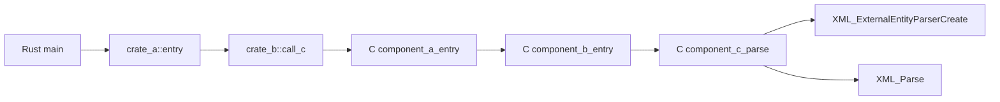
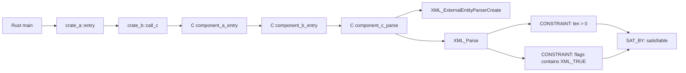
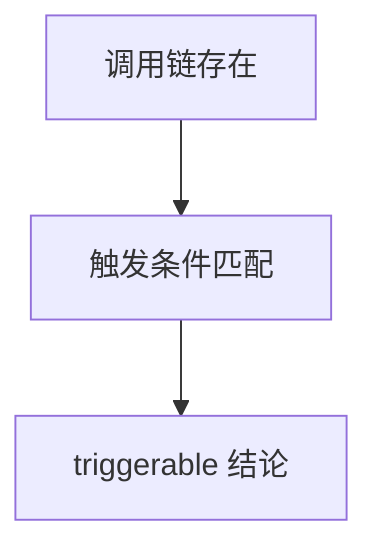
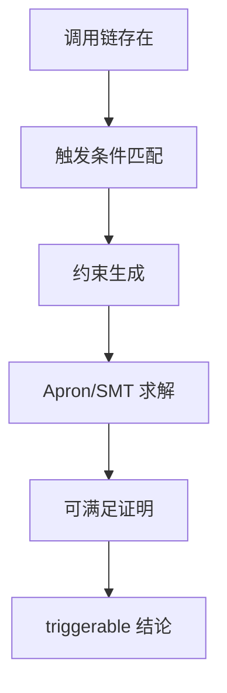

# Apron/约束求解引入规划文档（含图示）

> 目标：在现有 TTSG 基础上，引入 Apron/SMT 约束求解，实现“路径可触发性”的严格判定，并直观展示引入前后的调用图差异与检测流程变化。

---

## 1. 引入目标与范围

- 目标：把“触发性判定”从“条件匹配”升级为“约束可满足证明”。
- 范围：仅用于 n‑day 漏洞（规则库已知），不做 0day 发现。

---

## 2. 约束求解总体流程

1. 从调用链抽取语义（buf/len/flags/callback）
2. 从控制流提取路径约束（if/while/flags）
3. 将约束转换为 Apron/SMT 可解形式
4. 求解得到 satisfiable / unsat / unknown
5. 回写结果到 TTSG 与报告字段

---

## 3. 模块拆分与输入输出

### 3.1 新增模块

- `constraint_builder`：
  - 输入：TTSG 语义信息 + 触发条件
  - 输出：约束表达式集合

- `constraint_solver`：
  - 输入：约束表达式集合
  - 输出：求解结果（sat/unsat/unknown）

- `constraint_writer`：
  - 把求解结果回写到报告/图数据库

### 3.2 输入数据

- `ffi_semantics`（buf/len/flags 语义）
- `trigger_model`（触发条件）
- `sanitizer`（防护条件）

### 3.3 输出数据

```json
"constraint_result": {
  "status": "satisfiable|unsat|unknown",
  "solver": "apron|smt",
  "constraints": ["len>0", "flags contains X"]
}
```

---

## 4. 引入前后调用图的变化

### 4.1 引入前（仅调用与条件匹配）



**特点：**
- 只能证明“函数可达”
- 触发条件为字符串匹配

### 4.2 引入后（调用链 + 约束节点）



**特点：**
- 触发条件被显式“约束化”
- 结果是“可满足证明”而非猜测

---

## 5. 检测流程变化（引入前后）

### 5.1 引入前



### 5.2 引入后



---

## 6. 分阶段落地计划

### 阶段 1：轻量约束（规则级）
- `len > 0`
- `flags contains`
- 直接布尔判断

### 阶段 2：Apron 引入
- 数值域约束求解
- len 范围计算

### 阶段 3：SMT 引入
- bitmask/flags 精确求解
- 多条件组合与路径可满足性

---

## 7. 风险与注意事项

- 约束过强 → 漏报
- 约束过弱 → 误报
- 需保留 `unknown` 状态，避免误判

---

## 8. 预期价值

- **更强的触发性判定**
- **更低误报率**
- **更清晰的可解释性**

---

