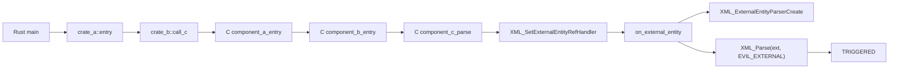
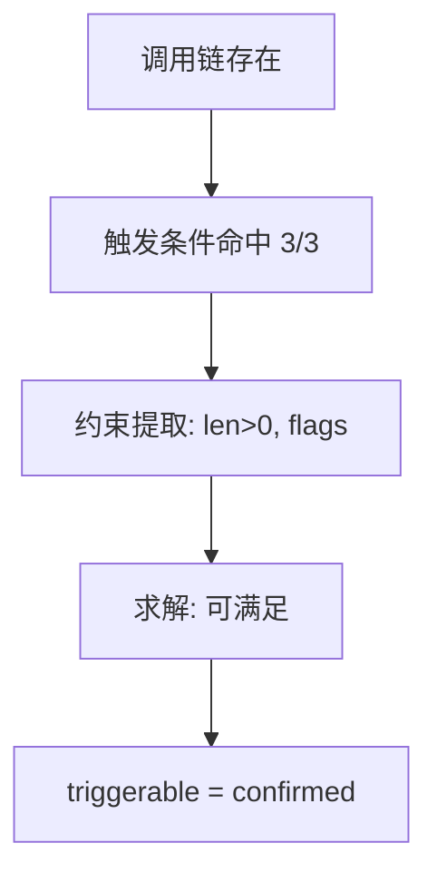

# PoC 解释文档：TTSG + 约束可满足判断（CVE‑2024‑28757）

> 目的：用当前 PoC 给导师清晰解释“调用链、约束条件、可触发判定”的完整逻辑与证据。

---

## 1. PoC 背景

该 PoC 展示 Rust → 多层 C 组件 → 第三方 C 库（expat）的跨语言供应链漏洞触发路径。

检测关注：
- **可达性**：调用链 + 依赖链是否连通
- **可触发性**：触发条件是否满足 + 约束是否可满足

---

## 2. 调用链（跨语言多层间接依赖）

**实际调用链：**

1. `Rust main`
2. `crate_a::entry`
3. `crate_b::call_c`
4. `component_a_entry`
5. `component_b_entry`
6. `component_c_parse`
7. `XML_SetExternalEntityRefHandler`
8. `on_external_entity`
9. `XML_ExternalEntityParserCreate`
10. `XML_Parse`（外部实体解析）

**图示：**



---

## 3. 触发条件模型（Trigger Model）

本 PoC 中的触发条件（必要条件）：

- `XML_SetExternalEntityRefHandler`（注册外部实体回调）
- `XML_ExternalEntityParserCreate`（创建外部实体解析器）
- `XML_Parse`（执行解析）

防护条件（mitigations）：

- `XML_SetFeature(..., XML_FEATURE_EXTERNAL_* , 0)`（禁用外部实体）

---

## 4. FFI 语义对齐（参数语义）

关键调用：

```
XML_Parse(parser, xml_buf, xml_len, XML_TRUE)
```

参数语义：
- `arg2 = buf`（输入 XML 缓冲区）
- `arg3 = len`（输入长度）
- `arg4 = flags`（解析选项）

这一步的意义：
- 能判断**输入是否可控**（buf/len）
- 能判断**行为是否可触发**（flags）

---

## 5. 约束条件（Constraints）

从代码与语义中抽取的约束：

1. **路径约束**：
   - `xml_len > 0`（因为 `if (xml_len <= 0) return`）

2. **条件约束**：
   - 必须出现 `XML_SetExternalEntityRefHandler`
   - 必须出现 `XML_ExternalEntityParserCreate`
   - 必须出现 `XML_Parse`

3. **语义证据**：
   - `buf/len` 结构存在
   - `flags` 出现（`XML_TRUE`）

---

## 6. 逻辑判断过程（是否可触发）

判断流程：

1. **调用链存在** → 可达性成立
2. **触发条件全部命中** → 进入触发性判断
3. **约束是否可满足**：
   - `xml_len > 0` 可满足
   - 无防护条件命中
   - flags 允许解析

结论：

- **可触发性 = confirmed**

---

## 7. 约束可满足判定图示



---

## 8. 工具输出中对应字段

最终报告中关键字段包括：

- `dependency_chain`
- `call_chain`
- `trigger_model_hits`
- `ffi_semantics`
- `constraint_result`

示例（概念）：

```json
"constraint_result": {
  "status": "satisfiable",
  "constraints": ["trigger_conditions_matched=3/3", "buf_len_pattern_present", "flags_observed"],
  "solver": "lightweight"
}
```

---

## 9. 一句话总结（给导师）

> 该 PoC 中，系统不仅证明漏洞函数可达，还通过触发条件模型与参数语义对齐，提取约束并进行可满足判断，最终给出“可触发”的可解释结论。

