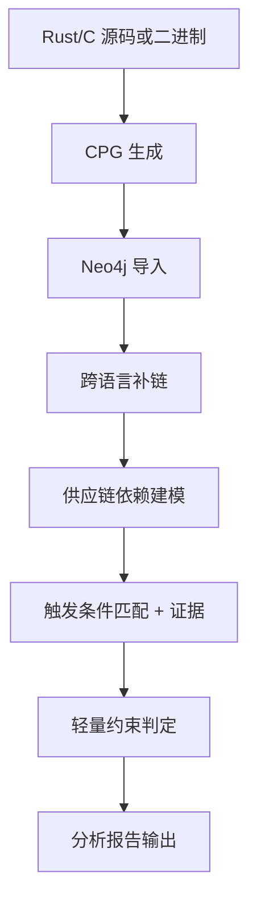
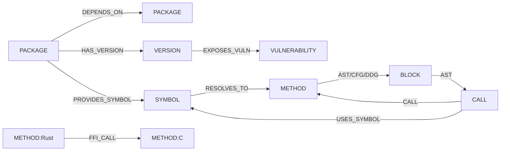
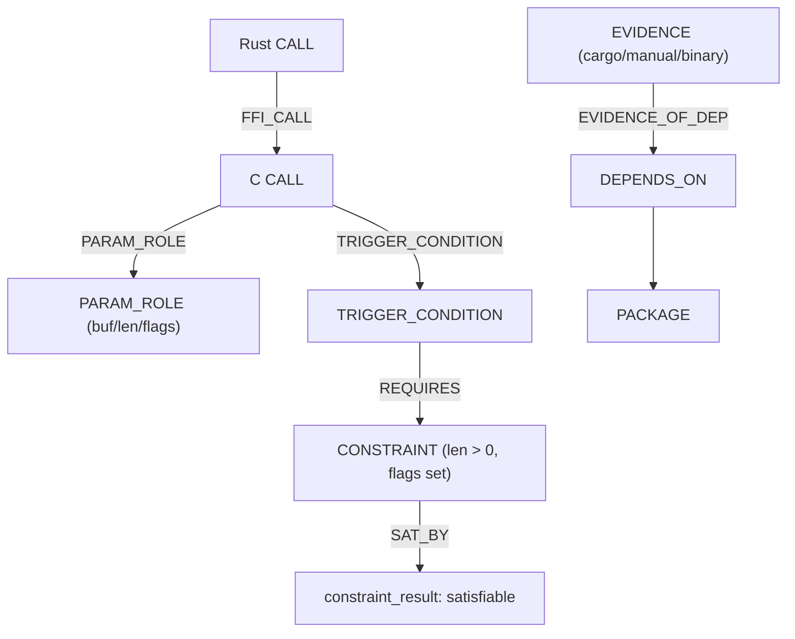

# 项目核心技术文档（v1）

> 本文档是项目唯一核心技术说明。任何新增功能或规则都必须同步更新本文档，确保其他 agent 读完即可完整理解项目功能与技术实现。

---

## 1. 项目目标与范围

目标：对 **跨语言 + 间接依赖** 的 n‑day 供应链漏洞进行 **可达性** 与 **可触发性** 检测。

范围：
- 不做 0day 漏洞发现。
- 依赖 CVE/规则库进行检测。

输出：
- 可达性与可触发性结论
- 完整依赖链与调用链
- 触发条件证据与约束结果

---

## 2. 关键概念

- 可达性：调用链 + 供应链依赖链是否连通到漏洞符号
- 可触发性：触发条件是否满足，是否存在可满足输入
- 证据链：依赖链中每条边的来源与可信度
- TTSG（跨语言触发语义图）：把参数语义、触发条件与证据作为可解释元素
- 约束可满足性（Constraint Satisfiability）：用规则或求解器判断触发条件是否可满足

---

## 3. 系统架构

**架构视图**



---

## 4. 数据与工件

- CPG JSON：Rust/C 生成的节点与边集合
- 图数据库：Neo4j 存储 CPG + 供应链节点
- 规则库 JSON：CVE、触发条件、源/清理模式
- extras JSON：补充 C 组件依赖与证据
- 报告 JSON：检测结果与证据输出

---

## 5. 图模型：节点与边类型

### 5.0 图模型示意图



### 5.1 CPG 节点

- `METHOD`
- `CALL`
- `BLOCK`
- `IDENTIFIER`
- `LITERAL`
- `METHOD_PARAMETER_IN`
- `METHOD_RETURN`

### 5.2 供应链与规则节点

- `PACKAGE`
- `VERSION`
- `VULNERABILITY`
- `SYMBOL`

### 5.3 关系（边）

- `AST` / `CFG` / `DDG` 等 CPG 基础关系
- `CALL`：函数调用
- `FFI_CALL`：Rust → C 的跨语言调用
- `DEPENDS_ON`：包依赖
  - 属性：`evidence_type` / `confidence` / `source` / `evidence`
- `HAS_VERSION`：包与版本
- `EXPOSES_VULN`：版本暴露漏洞
- `PROVIDES_SYMBOL`：包提供漏洞相关符号
- `RESOLVES_TO`：符号解析到方法
- `USES_SYMBOL`：调用使用符号
- `PKG_CALL`：跨包调用（推导关系）

---

## 6. TTSG（跨语言触发语义图）实现方式

### 6.0 TTSG 示意图



当前 TTSG 以 **报告级语义结构** 体现，核心字段包括：

- `ffi_semantics`
- `trigger_model_hits`
- `dependency_chain_evidence`

TTSG 作用是将“触发条件 + 参数语义 + 依赖证据”统一输出，形成可解释触发路径。

---

## 7. 供应链依赖证据链建模

### 7.1 证据类型

- `cargo`：来自 cargo metadata
- `manual`：extras 手工补充
- `binary`：二进制依赖分析（规划）
- `symbol`：符号推断（规划）

### 7.2 输出格式

报告新增 `dependency_chain_evidence`：

```json
[
  {"from":"app","to":"crate_a","evidence_type":"cargo","confidence":"high"},
  {"from":"crate_b","to":"compa","evidence_type":"manual","confidence":"low"}
]
```

---

## 8. 触发条件模型

### 8.1 规则结构

规则 JSON 中使用：
- `trigger_model.conditions`：必须满足的触发条件
- `trigger_model.mitigations`：防护条件
- `source_patterns` / `sanitizer_patterns`

### 8.2 判定逻辑

- 必要条件全命中且未命中防护 → `confirmed`
- 部分命中 → `possible`
- 无命中 → `unknown`

---

## 9. FFI 语义对齐

### 9.1 参数角色识别

- `buf`：输入数据缓冲区
- `len`：缓冲区长度
- `flags`：控制行为的开关
- `callback`：回调函数指针

### 9.2 输出字段

报告新增 `ffi_semantics`，示例：

```json
{
  "name":"XML_Parse",
  "param_roles":{"arg2":"buf","arg3":"len","arg4":"flags"},
  "flags_evidence":["XML_TRUE"],
  "notes":["buf/len pattern matched"]
}
```

---

## 10. 约束可满足性（轻量版）

当前实现为轻量规则，输出字段 `constraint_result`：

- `status`: `satisfiable` / `unsatisfiable` / `unknown`
- `constraints`: 已识别的触发约束
- `solver`: `lightweight`

示例：

```json
{
  "status":"satisfiable",
  "constraints":["trigger_conditions_matched=3/3","buf_len_pattern_present","flags_observed"],
  "solver":"lightweight"
}
```

规划：引入 Apron/SMT 进行严格可满足证明。

---

## 11. 报告输出结构（关键字段）

- `reachable`
- `triggerable`
- `dependency_chain`
- `dependency_chain_evidence`
- `call_chain`
- `functions_involved`
- `trigger_point`
- `conditions`（触发条件 + 命中证据）
- `ffi_semantics`
- `constraint_result`

---

## 12. 已验证场景

- Rust → 多层 C → 第三方库
- 可达性与可触发性均可输出
- 触发条件与参数语义证据可解释

---

## 13. 维护要求

- 本文档为核心文档，任何更新必须同步补充。

---
