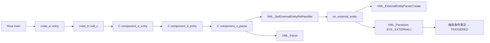
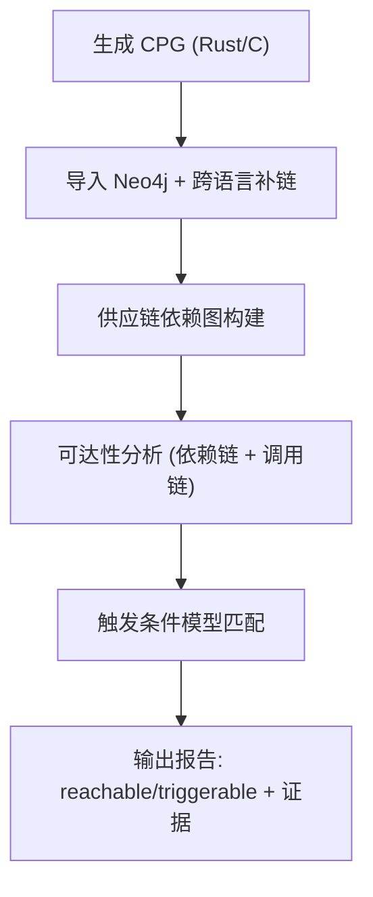

# 跨语言供应链漏洞检测工具汇报文档

## 1. 项目目标与定位

本工具面向“跨语言 + 间接依赖”的供应链漏洞检测，目标是回答两个核心问题：

- **可达性**：漏洞函数是否可被上层业务调用到达？
- **可触发性**：在可达路径上，触发漏洞所需的条件是否满足？

区别于传统“只到达漏洞函数”的方法，本工具强调：**可触发性 = 调用链 + 条件模型**。

## 2. 实际 PoC 说明（CVE-2024-28757）

该 PoC 已经完成并可运行，覆盖“Rust → 多层 C 组件 → 第三方 C 库”的真实供应链场景。

运行效果（控制台可见触发）：

- 触发输出示例：`TRIGGERED total=...`
- 说明漏洞被实际触发，且路径跨越 Rust + 多层 C + expat。

## 3. 图示

### 3.1 漏洞调用链图（跨语言多层间接依赖）

### 3.2 分析流程图（可达性 + 条件触发性）

## 4. 当前工具的主要功能

1. **跨语言 CPG 构建与导入**
   - Rust CPG + C CPG 统一导入 Neo4j，建立跨语言调用图。

2. **供应链依赖建模**
   - Rust 部分通过 `cargo metadata` 自动导入依赖。
   - C 组件通过 `extras` JSON 补充，构建跨语言依赖链。

3. **可达性分析**
   - 基于 CPG 跨语言调用路径 + `DEPENDS_ON` 供应链链路，判断漏洞是否可达。

4. **可触发性分析（条件约束型）**
   - 新增“触发条件模型”，不再仅依赖漏洞函数可达。
   - 对触发条件进行匹配与证据输出。

5. **证据输出**
   - 输出完整依赖链、调用链、触发条件命中证据。

## 5. 如何实现（实现细节）

### 5.1 数据流与调用链

- 生成 Rust/C CPG
- 导入 Neo4j
- 修补 C 侧调用边与 Rust 调用边
- 建立跨语言 FFI 调用连接
- 查找从 `main` 到漏洞符号的最短路径

关键分析逻辑：

### 5.2 触发条件模型（通用）

新增字段示例（通用模型）：

- `trigger_model.conditions`：必须满足的调用条件
- `trigger_model.mitigations`：防护条件（命中则降级）

示例条件：

- `XML_SetExternalEntityRefHandler`
- `XML_ExternalEntityParserCreate`
- `XML_Parse`

工具会在 CPG 调用链和方法体中查找这些条件，并输出证据（具体调用代码）。

## 6. 当前能解决的问题

- 能识别 Rust → C → C → 第三方库的多层间接触发路径。
- 具备“触发条件模型”，可以降低纯“到达漏洞函数”的误报。
- 输出可解释证据（调用链 + 触发条件命中），便于人工验证。

## 7. 当前创新点（可用于论文）

### 6.1 条件约束型可触发性

- 不是“函数可达 = 可触发”，而是“路径可达 + 条件满足”。
- 规则模型为 JSON，可扩展到多类漏洞。

### 6.2 跨语言调用链证据输出

- 输出跨语言链路与触发证据。
- 支撑供应链漏洞的“可解释检测”。

## 8. 当前不足与风险

- 二进制-only 组件仍依赖人工补充 `extras`。
- FFI 调用参数语义（buf/len/flags）尚未系统对齐。
- 触发条件模型目前只有少量手工规则。

## 9. 未来工作计划（重点说明两个方向）

### 8.1 二进制/间接依赖证据链建模

**目标**：即使无源码，也能自动构建可信依赖链，并输出证据来源与置信度。

**具体计划**：

1. **证据来源分类**
   - `build证据`：`build.rs`、`pkg-config`、`cargo:rustc-link-lib`
   - `二进制证据`：`otool -L` / `readelf -d` / `ldd`
   - `符号证据`：`nm -D` / `objdump -T`
   - `手工补充证据`：JSON extras

2. **依赖边加入证据字段**
   - `DEPENDS_ON {evidence_type, confidence, source_file, evidence_snippet}`

3. **间接依赖链自动推断**
   - A → libX.so → libY.so
   - 依赖链输出时附带每条边的证据与可信度

4. **输出格式增强**
   - `dependency_chain_evidence` 字段
   - 报告中输出“依赖链证据表”

**价值**：解决供应链检测里最难的“二进制-only组件”问题，提升结论可信度。

### 8.2 跨语言 ABI/FFI 语义对齐

**目标**：不仅链接函数名，还能识别参数语义，提升触发性判断精度。

**具体计划**：

1. **FFI 参数语义标注**
   - `param_roles`: `buf / len / flags / callback`
   - `ffi_signature`: 函数签名与参数顺序

2. **参数模式识别**
   - Rust `as_ptr()` + `len()` → `buf/len` 约束
   - C 侧 `strlen()` / `size` 参数 → `len` 角色

3. **触发条件增强**
   - 引入 `flag_required` / `flag_forbidden`
   - 结合 `call_code_contains` 判断是否开启危险选项

4. **触发证据输出**
   - 在报告中输出：
     - `ffi_signature`
     - `param_match`
     - `flags_evidence`

**价值**：把“函数可达”升级为“参数条件满足”，显著降低误报。

## 10. 结论与汇报建议

- 工具已具备跨语言、多层间接依赖的可达性检测能力。
- 触发条件模型已初步落地，具备论文创新基础。
- 后续围绕“证据链建模”和“FFI语义对齐”完善，可成为完整供应链检测框架。

如果老师关注“实际价值”，建议强调：

- 供应链漏洞的最大挑战是“无源码 + 多层依赖”。
- 本工具正面解决这个问题，并提供可解释证据链。
