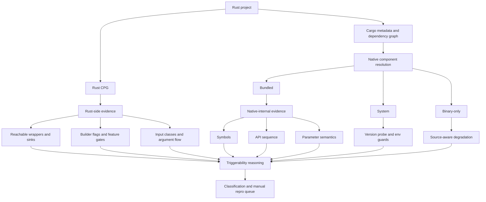

# Rust-Native 供应链漏洞检测工具顶会投稿分析与后续计划

## 1. 这份文档回答什么问题

这份文档基于当前 `VUL/cases/by-analysis-status` 中已经归档的检测结果，以及当前工具在源码层面的真实能力，回答 6 个问题：

1. 这套工具如果要发顶会，最核心的创新点应该怎么提炼。
2. 这套工具当前最难、最值钱的技术点是什么。
3. 相比已有研究，哪些点可以主张为“目前别人没有系统做到”。
4. 如果现在就投稿，最可能被审稿人质疑的缺陷是什么。
5. 接下来应该优先做哪些人工复现和工具改进，才能把论文证据补足。
6. 论文应该如何组织成一个“能成立”的故事线，而不是只展示若干工程结果。

---

## 2. 当前证据基线

### 2.1 当前数据集状态

当前归档总数来自 [index.json](/Users/dingyanwen/Desktop/VUL/cases/by-analysis-status/index.json)：

- 总 case 数：`91`
- `triggerable_confirmed`：`16`
- `triggerable_possible`：`12`
- `reachable_only`：`1`
- `not_reachable`：`8`
- `analysis_failed`：`50`
- `analysis_timeout`：`4`

按归档目录分类：

- `01_runnable_and_observable_triggered`：`1`
- `02_runnable_and_path_triggered`：`1`
- `03_runnable_but_not_observed`：`3`
- `03_runnable_static_triggerable_confirmed`：`13`
- `03_runnable_static_triggerable_possible`：`10`
- `04_runnable_reachable_only`：`1`
- `05_runnable_not_reachable`：`8`
- `06_not_runnable_analysis_failed`：`50`
- `07_not_runnable_timeout`：`4`

可以据此得到几个重要结论：

- 当前有 `37/91` 个项目至少已经进入“可运行并得到稳定静态结论”的区间。
- 当前有 `28/91` 个项目被静态判为 `confirmed` 或 `possible`，说明工具已经不是只做“依赖命中”。
- 当前只有 `1` 个 case 拿到了“漏洞本体可观测触发”，还有 `1` 个拿到了“真实 native 路径已被恶意输入打到”。
- 当前最大的短板不是“完全没命中”，而是“人工复现和环境可运行性远弱于静态检测能力”。

### 2.2 当前最强的正例

当前最强的正例有两个：

1. `zlib / CVE-2022-37434`
   目录在 [cve-2022-37434-libz-sys__harness](/Users/dingyanwen/Desktop/VUL/cases/by-analysis-status/01_runnable_and_observable_triggered/CVE-2022-37434__zlib/cve-2022-37434-libz-sys__harness)。
   这个 case 已经拿到 ASan `heap-buffer-overflow` 证据，是目前最接近论文“端到端闭环”要求的样本。

2. `openh264 / CVE-2025-27091`
   目录在 [hs-hackathon-drone-0.1.4__upstream](/Users/dingyanwen/Desktop/VUL/cases/by-analysis-status/02_runnable_and_path_triggered/CVE-2025-27091__openh264/hs-hackathon-drone-0.1.4__upstream)。
   这个 case 已经说明恶意 H.264 输入确实进入真实 native decoder 路径，但尚未观测到漏洞本体内存破坏。

这两个 case 非常关键：

- `zlib` 证明这套工具不是只能做 reachability。
- `openh264` 证明这套工具已经能把“静态规则命中”推进到“真实输入抵达 native 危险边界”。

### 2.3 当前最强的静态池

当前最值得做下一轮人工复现的静态池如下：

- `libxml2`：`7 confirmed + 1 possible`
- `openh264`：`4 confirmed`
- `libwebp`：`3 confirmed`
- `openssl`：`8 possible`
- `libheif`：`1 possible`

这说明工具当前最擅长的，不是所有 native CVE，而是：

- 输入对象可抽象成 `bytes/string/file/network frame/certificate`
- Rust 侧到 native sink 的路径较短
- 触发条件可拆成 `版本 + 路径 + API 序列/flag/输入类别`

---

## 3. 当前工具实际做到了什么

这部分必须严格按当前实现说，不能把“希望做到”写成“已经做到”。

### 3.1 实际能力链

从实现上看，这套工具已经具备以下能力：

1. Rust 项目依赖和版本解析  
   入口逻辑在 [supplychain_analyze.py#L400](/Users/dingyanwen/Desktop/RUST_IR/cpg_generator_export/tools/supplychain/supplychain_analyze.py#L400)。

2. Rust CPG 生成与后续分析入口  
   生成逻辑在 [supplychain_analyze.py#L282](/Users/dingyanwen/Desktop/RUST_IR/cpg_generator_export/tools/supplychain/supplychain_analyze.py#L282)。

3. 将漏洞知识库规则自动并入 case  
   规则并入逻辑在 [supplychain_analyze.py#L571](/Users/dingyanwen/Desktop/RUST_IR/cpg_generator_export/tools/supplychain/supplychain_analyze.py#L571)，规则知识库存放在 [sink_knowledge_base.json](/Users/dingyanwen/Desktop/RUST_IR/cpg_generator_export/tools/supplychain/sink_knowledge_base.json)。

4. 识别 native 组件实例，并区分 `bundled/system/binary-only`  
   逻辑在 [supplychain_analyze.py#L763](/Users/dingyanwen/Desktop/RUST_IR/cpg_generator_export/tools/supplychain/supplychain_analyze.py#L763)。

5. 当 native 组件来自系统库时，做系统版本探测  
   版本探测入口在 [supplychain_analyze.py#L716](/Users/dingyanwen/Desktop/RUST_IR/cpg_generator_export/tools/supplychain/supplychain_analyze.py#L716)，版本证据接入在 [supplychain_analyze.py#L768](/Users/dingyanwen/Desktop/RUST_IR/cpg_generator_export/tools/supplychain/supplychain_analyze.py#L768)。

6. 当 native C 源码不存在时，退化到 Rust/source-text synthetic sink 证据，而不是直接失效  
   相关逻辑在 [supplychain_analyze.py#L2382](/Users/dingyanwen/Desktop/RUST_IR/cpg_generator_export/tools/supplychain/supplychain_analyze.py#L2382)。

7. 支持“触发条件”而不仅是“调用到达”  
   包括：
   - `api_sequence`，见 [supplychain_analyze.py#L3359](/Users/dingyanwen/Desktop/RUST_IR/cpg_generator_export/tools/supplychain/supplychain_analyze.py#L3359)
   - `input_predicate`，见 [supplychain_analyze.py#L3694](/Users/dingyanwen/Desktop/RUST_IR/cpg_generator_export/tools/supplychain/supplychain_analyze.py#L3694)
   - `existential_inputs`，见 [supplychain_analyze.py#L2686](/Users/dingyanwen/Desktop/RUST_IR/cpg_generator_export/tools/supplychain/supplychain_analyze.py#L2686)
   - `param_semantics`，见 [param_semantics.py#L1797](/Users/dingyanwen/Desktop/RUST_IR/cpg_generator_export/tools/verification/param_semantics.py#L1797)
   - `field_to_call_arg / option_to_call_arg / len_to_call_arg`，实现位于 [supplychain_analyze.py](/Users/dingyanwen/Desktop/RUST_IR/cpg_generator_export/tools/supplychain/supplychain_analyze.py)

8. 当没有 C body 时，自动跳过“必须依赖 C 调用顺序”的 guard，避免错误降级  
   逻辑在 [supplychain_analyze.py#L3403](/Users/dingyanwen/Desktop/RUST_IR/cpg_generator_export/tools/supplychain/supplychain_analyze.py#L3403) 和 [supplychain_analyze.py#L3438](/Users/dingyanwen/Desktop/RUST_IR/cpg_generator_export/tools/supplychain/supplychain_analyze.py#L3438)。

9. 将结果分层为 `not_reachable / reachable_only / possible / confirmed / path_triggered / observable_triggered` 等研究型分类  
   归档结果体现在 [by-analysis-status](/Users/dingyanwen/Desktop/VUL/cases/by-analysis-status)。

### 3.2 这套工具的真实定位

更准确地说，这套工具当前不是：

- 纯 SCA 版本匹配器
- 纯 Rust bug finder
- 纯动态复现器
- 通用混合语言全自动程序理解器

它当前更像是：

> 一个面向 Rust-native 供应链 n-day 漏洞的、结合依赖解析、Rust CPG、native 规则、输入/状态 guard 和人工复现归档的 exploitability triage 系统。

这个定位很重要，因为论文卖点不应该是“我能自动证明所有漏洞都能触发”，而应该是：

- 我比版本扫描更接近真实 exploitability。
- 我比纯 reachability 更接近漏洞触发条件。
- 我比单纯动态 fuzz 更适合大规模筛选真实项目。

可以把当前系统抽象成下面这个双层框架：

---

## 4. 如果要发顶会，最核心的创新点是什么

下面这些点是当前最可能成立的论文创新主张。

### 4.1 创新点一：面向 Rust-native 供应链漏洞的 exploitability 分析，而不是停留在依赖命中

现有大量供应链安全工作要么停在：

- 依赖级版本匹配
- 代码级 reachability
- 单语言生态内的 exploitability 判定

而你这套工具关注的是：

- `Rust project -> Rust crate -> sys/FFI crate -> native C component`
- 然后再判断：
  - 版本是否在漏洞范围内
  - 危险 native sink 是否真实可达
  - 项目侧是否满足特定触发 guard
  - 最后是否值得人工复现

这个问题设定本身就比常见的 Rust 工具和常见的 SCA 工具更难。

### 4.2 创新点二：把“漏洞触发条件”显式建模成规则，而不是只看 sink reachability

当前实现里，规则已经不只是“有没有调用某个函数”，而是把下列要素显式拉进分析：

- API 调用顺序
- 输入类别
- 参数位、长度位、flag 位
- builder 链
- feature gate
- 系统库/打包库来源
- 输入存在性约束
- 某些没有 C body 时的降级策略

这使得工具输出从“reachable”升级到了：

- `TriggerableWithInputAssumption`
- `confirmed`
- `possible`
- `path triggered`
- `observable triggered`

这类分层语义对论文非常有价值，因为它提供了一个比二元分类更接近真实世界的结果空间。

### 4.3 创新点三：当 native C 源码存在时，能把分析推进到组件内部顺序和参数语义

这一点是你当前工具最值钱、也最应当强调的部分。

当前工具并不是只在 Rust 边界看 wrapper 函数名；当 C 组件源码存在并能进入图时，工具可以进一步利用：

- native symbol
- native sink
- C 侧 API sequence
- 部分参数语义与长度语义

这和只做 Rust 边界匹配是本质不同的。

对于顶会论文，建议把这点表述为：

> 工具不是把 FFI 当作不可穿透黑箱，而是实现了“Rust-visible exploitability + native-internal rule validation”的双层证据框架。

### 4.4 创新点四：在缺少 C 源码时，不是直接失效，而是进行“保守降级”

这点工程上很重要，研究上也有价值。

现实里的很多 case 都没有完整 native body，或者运行时链接的是系统库。如果这时分析器只能二选一：

- 要么误报
- 要么直接放弃

就很难在真实项目上工作。

你当前工具已经做了更合理的事：

- 有 C body：验证更强的 sequence / parameter / symbol 证据
- 没 C body：跳过纯 C 顺序 guard，但保留 Rust 边界和 source text 的强证据

这提供了一个很适合写成论文贡献的“source-aware degradation”设计。

### 4.5 创新点五：把静态分析输出和人工复现工作流统一到同一分类体系里

很多工具输出只是一个 JSON 或一个 score。

你现在已经有一套实际在使用的结果分层：

- 仅可达
- 静态 possible
- 静态 confirmed
- 路径已被恶意输入打到
- 漏洞本体可观测触发
- 失败
- 超时

这意味着工具不仅是在“检测”，还在组织后续研究流程：

- 哪些样本值得优先手工复现
- 哪些失败是环境问题
- 哪些是版本问题
- 哪些是路径已到但漏洞体未观测

这类“analysis-to-reproduction workflow”是论文里很容易转化成 methodology 贡献的。

---

## 5. 技术难点在哪里

这些难点同时是论文价值所在，也是当前工程成本最高的部分。

### 5.1 难点一：Rust 依赖版本不等于 native 实际版本

你已经在 `openssl` 上踩到这个问题：

- Rust wrapper crate 版本不等于底层 C OpenSSL 版本
- `bundled` 和 `system` 的版本解析完全不同
- 同一个项目在不同机器上可能链接到不同系统库版本

这意味着供应链 exploitability 不能只靠 `Cargo.lock`，必须把 native version resolution 做成一等公民。

### 5.2 难点二：特性开关、构建模式和真实运行路径高度相关

你已经在 `ripgrep / pcre2` 上验证过：

- 源码里存在 PCRE2 路径，不代表默认构建启用了该路径
- `--features pcre2` 和默认构建结论不同

因此，真实 exploitability 需要同时建模：

- feature gate
- 构建 profile
- 打包方式
- 系统依赖可见性

### 5.3 难点三：FFI 把很多漏洞条件切碎到了 Rust 侧和 C 侧两边

真实漏洞条件经常不是完全位于一边：

- Rust 侧决定“是否会走到这个 decoder/parser/builder”
- C 侧决定“是否满足内部状态机、长度和顺序约束”

如果只看 Rust 侧，会过度乐观。
如果只看 C 侧，又看不到真实项目如何把输入送进去。

这正是这套工具最难、也最有价值的地方。

### 5.4 难点四：漏洞路径可触发，不代表漏洞本体可观测

`openh264` 就是最典型的例子：

- 静态路径成立
- 恶意输入已进入真实 native path
- 但没有观测到堆溢出或 ASan 报告

因此，论文中必须把“触发”拆层，而不能把所有正例都当作“已复现漏洞本体”。

### 5.5 难点五：真实项目的失败大多来自环境，而不是规则本身

当前 `analysis_failed = 50`，其中相当一部分并不是“工具不会分析”，而是：

- 系统库缺失
- bindgen/header 缺失
- 旧项目依赖已坏
- Rust CPG 没成功导入

代表例子：

- `gdal-sys` 缺系统库，见 [erdy-0.1.3__upstream](/Users/dingyanwen/Desktop/VUL/cases/by-analysis-status/06_not_runnable_analysis_failed/CVE-2021-45943__gdal/erdy-0.1.3__upstream)
- `libxml2` 头文件缺失，见 [fatoora-core-0.1.3__upstream](/Users/dingyanwen/Desktop/VUL/cases/by-analysis-status/06_not_runnable_analysis_failed/CVE-2025-6021__libxml2/fatoora-core-0.1.3__upstream)
- Rust CPG 不可用，见 [domain-0.11.1__upstream](/Users/dingyanwen/Desktop/VUL/cases/by-analysis-status/06_not_runnable_analysis_failed/CVE-2022-3602__openssl/domain-0.11.1__upstream)

这对论文的含义是：

- 失败率不能简单算成算法失败率。
- 必须把“环境失败”和“分析误判”分开统计。

---

## 6. 相比已有研究，哪些点最可能是别人没系统做过的

下面这些主张必须谨慎表述为：

> to the best of our knowledge

### 6.1 现有研究各自擅长什么

| 代表工作 | 更强的点 | 目前与你工具的关键差异 |
| --- | --- | --- |
| Eclipse Steady / Vulas | 代码中心的依赖漏洞 reachability，最初面向 JVM 生态 | 不解决 Rust 到 native C 组件的 exploitability 分层，也不强调 native 内部 sequence/param 规则 |
| VulTracer | 在 NPM 生态里做更精确的 exploitability 识别 | 主要是单生态 JS 包，不处理 Rust FFI 到 native 组件内部规则 |
| ChainFuzz | 面向已知漏洞做下游动态验证/模糊测试 | 更偏动态验证，不提供你这种“静态证据分层 + 复现工作流归档”框架 |
| RUDRA / MirChecker | Rust 语言自身的 bug/unsafe misuse 检测 | 不是面向已知 native 组件 CVE 的下游供应链 exploitability |
| FFIChecker / Cross-Language Attacks / Omniglot | 研究 FFI 和跨语言边界引入的安全问题 | 不是针对真实公开 CVE 的 Rust-native exploitability 分析与项目筛选 |

### 6.2 最可能成立的“新”点

结合当前实现和上面这些工作，最可能成立的独特点是：

1. **Rust-native n-day 供应链漏洞 exploitability 这一问题本身还缺少成熟系统。**  
   已有工作要么在 JVM/JS 生态，要么做 Rust 本体 bug，要么做 FFI 安全问题，但很少把真实 Rust 项目中的 native C 组件 CVE exploitability 做成一体化系统。

2. **把 native 组件“内部可验证规则”接到供应链 exploitability 分析里，这一点很少见。**  
   现有 reachability 工作通常停在调用可达；你这里已经引入了 C 侧 sequence/param guard。

3. **把“无 C 源码”和“有 C 源码”的分析语义统一到一个框架里，目前公开工作里不常见。**  
   这部分特别适合写成 source-aware exploitability reasoning。

4. **把结果分成 `static confirmed / static possible / path triggered / observable triggered` 这种研究型层级，目前公开工作里也不常见。**  
   大多数系统不是二元 reachability，就是纯动态 crash；你这里形成的是一条中间证据链。

5. **围绕真实项目归档失败原因、复现输入和分类迁移，也很少被作为系统设计的一部分。**  
   你这套 `by-analysis-status` 体系实际上已经是一个研究资产，而不只是结果文件夹。

### 6.3 这部分不能过度声称什么

当前还不能声称：

- “我们是第一个做 Rust 供应链漏洞分析的系统”
- “我们能自动确认漏洞真实可触发”
- “我们能自动跨越所有 FFI 边界重建完整调用图”
- “我们已经大规模证明对真实世界漏洞有效”

更稳妥的表述应是：

- “我们首次系统化探索 Rust-native n-day 供应链漏洞 exploitability”
- “我们提出了结合 Rust 项目证据与 native 内部规则的双层分析框架”
- “我们展示了该框架在多个真实漏洞家族上的可行性，并通过分层复现验证其有效性”

---

## 7. 如果现在投稿，最容易被审稿人打的点

### 7.1 缺少足够多的“漏洞本体可观测触发”样本

目前只有 `zlib` 这一类拿到了很强的可观测证据。

这会导致审稿人质疑：

- 工具是否真正提高了 exploitability 判定，而不只是 improved reachability
- `confirmed` 和 `possible` 的边界是否经过实证校准
- `TriggerableWithInputAssumption` 到底在多大程度上对应真实触发

### 7.2 当前失败率仍然太高

`50 failed + 4 timeout` 对顶会来说会被直接问：

- 是算法不行，还是工程环境问题？
- 如果换机器，结果是否稳定？
- 这个系统能否被第三方复现？

如果没有容器化环境、缺陷分类和剥离分析，很难说服审稿人。

### 7.3 规则生成仍然较重人工

虽然你已经开始做自动 `vulns.json` 生成，但目前整体仍偏：

- 人工挑漏洞家族
- 人工定义 sink
- 人工定义 input class
- 人工调整 version/source 语义

审稿人很可能会问：

- 新漏洞家族接入成本多高？
- 如果没有专家写规则，系统还能跑多远？

### 7.4 混合语言“内部分析”还需要更系统的实证

你已经有能力在 C 组件源码存在时检查 sequence/param 等，但目前论文证据还不够说明：

- 有 C body 时到底比无 C body 提升多少
- 哪些 family 真正受益于 C 内部规则
- 这种内部规则能减少多少误报

这是一个必须做 ablation 的点。

### 7.5 缺少强 baseline 对比

如果没有 baseline，论文很容易被解读成：

- 一个做得很细的工程系统
- 但没有证明“比已有方法更好”

至少需要 3 类 baseline：

1. 只看依赖版本
2. 只看 sink reachability
3. 版本 + reachability，但没有 trigger guard / native internal reasoning

---

## 8. 如果要发顶会，论文应该主打什么故事线

建议不要把论文讲成“我们能自动复现漏洞”，而要讲成下面这条主线：

### 8.1 论文主线

1. Rust 生态大量依赖 native 组件，已知 CVE 是否会影响真实项目，现有工具缺少 exploitability 级别判断。
2. 仅做版本匹配会过报，仅做 Rust reachability 又无法表达 native 内部前置条件。
3. 我们提出一个双层框架：
   - Rust 项目侧：依赖、调用路径、输入对象、builder/feature/guard
   - native 组件侧：symbol、API sequence、参数语义、版本来源
4. 我们再用 source-aware degradation 把“有无 C 源码”统一到一个分析框架。
5. 最后通过分层结果体系，把静态发现与人工复现连接起来。

### 8.2 论文里最应该强调的不是“100% 自动”，而是“研究闭环”

也就是这条证据链：

这张图其实就是你现在 `by-analysis-status` 的理论化表达。

---

## 9. 下一步工作计划

下面这部分是最重要的执行面。

### 9.1 第一优先级：扩大人工复现正例池

如果希望论文能站住，下一步必须优先把“静态 confirmed/possible”转换成更多人工结论。

#### A. `libxml2` 家族

当前池子最大，最值得优先投入。

优先对象：

- `7 confirmed + 1 possible`

复现时重点记录：

- 实际链接的 `libxml2` 版本
- 是 `system` 还是 `bundled`
- 走到的是 `XPath / parser / c14n / HTML` 哪条路径
- 触发需要的 parser mode、options、document shape
- 输入样本是否进入 native parse/eval 入口
- 如果没复现，卡在版本、feature、输入格式、还是内部状态前置条件

#### B. `libwebp` 家族

优先对象：

- 3 个 `confirmed`

复现时重点记录：

- 是否真实进入 `WebPDecode` / lossless 路径
- 实际使用的是 `bundled` 还是系统 `libwebp`
- 输入是否满足 lossless/crafted WebP 条件
- ASan 是否能稳定报错

#### C. `openh264` 家族

优先对象：

- 已有 1 个 `path_triggered`
- 另有 3 个 `static confirmed`

复现时重点记录：

- 是否逐 NAL 送入，还是整段 bitstream 一次送入
- error code 是否在同一轮 decode 中保持
- 是否需要保留 `WelsDecodeBs` 的状态连续性
- 是否需要 ASan/UBSan/native debug build

#### D. `openssl` 家族

优先对象：

- 8 个 `possible`

复现前必须先固定环境：

- 使用明确的脆弱 `OpenSSL 3.0.6`
- 记录证书链、SAN、邮箱名等构造
- 区分 `connect`、`accept`、`cert verify` 三类路径
- 记录是静态推断命中，还是能真实把恶意证书打入解析路径

#### E. `libheif` 家族

优先对象：

- 1 个 `possible`

主要问题不是规则，而是环境可运行性。

需要记录：

- `libheif` 安装方式
- 是否还依赖 `libde265`、`x265` 等附属库
- 输入是否能稳定进入 decode path

### 9.2 第二优先级：重新校准当前已“人工未观测”的案例

这几个 case 不应直接放弃，它们很适合作为“为什么静态和动态不一致”的分析样本。

#### `ripgrep / pcre2`

重点：

- 默认构建是否启用 `pcre2`
- 是否真的启用 JIT
- 恶意 regex 是否满足 CVE 对 pattern 的特殊要求

#### `git-cz / git-stack / libgit2`

重点：

- 真实 `libgit2` 版本是否在漏洞窗口内
- `revparse_single` 和 `revparse_ext` 哪条路径更接近漏洞条件
- 是否需要特定 repo state、HEAD、upstream、range 组合
- 是否是“路径已到达，但补丁条件不对”

### 9.3 第三优先级：把失败样本变成“可运行 benchmark”

当前失败样本数量太大，必须做系统整理。

建议将失败原因拆成至少 5 类，并单独统计：

1. 系统库缺失
2. 头文件/bindgen 缺失
3. Rust 依赖无法构建
4. CPG 生成/导入失败
5. 超时

只有这样，论文里才能说明：

- 真正属于分析算法局限的有多少
- 纯环境问题的有多少

---

## 10. 具体要记录哪些实验信息

从下一轮开始，每个人工复现样本都建议记录下面这些字段。

### 10.1 项目与版本信息

- 项目名、版本、tag/commit
- `Cargo.toml` / `Cargo.lock`
- 构建 feature
- 目标平台、编译器版本

### 10.2 native 组件信息

- native 组件名
- 实际版本
- `bundled / vendored / system / binary-only`
- C 源码是否进入分析图

### 10.3 静态分析信息

- `reachable / triggerable / result_kind`
- 命中的 sink/symbol
- 命中的 trigger guard
- 使用了哪些 assumption

### 10.4 动态复现信息

- 输入样本路径和哈希
- 是否进入目标路径
- 关键日志
- sanitizer 配置
- 是否出现 crash/ASan/UBSan

### 10.5 非复现原因

如果没有复现成功，必须显式记录到底是哪一类：

- 版本不对
- feature 没开
- 输入没进 sink
- 进了 sink，但没进漏洞窗口
- 进了错误路径，但没有可观测内存破坏
- 环境不稳定

---

## 11. 工具必须改进的具体功能

### 11.1 规则生成自动化

目标不是完全自动，而是把新 family 的接入成本大幅降低。

建议方向：

- 从 advisory / patch / PoC 自动抽取初始 `vulns.json`
- 自动建议 sink、版本范围、input class、feature guard
- 再由人工做最后校验

### 11.2 native 版本解析泛化

当前 `openssl` 已经说明这件事必须系统化。

建议把下面这些做成统一模块：

- system library version probe
- bundled source version extract
- wrapper crate version 和 native version 的映射/剥离
- 人工 override 机制

### 11.3 更强的 C 组件内部分析

如果论文要把“native internal rule validation”当创新点，就必须继续补强：

- C 侧 sequence 召回率
- 参数别名和长度推导
- Rust 到 C 参数对齐
- C body 缺失时的置信度校准

### 11.4 更强的构建矩阵探索

要把：

- feature
- target
- system dependency
- build mode

变成可枚举的分析维度，而不是一次性碰运气。

### 11.5 静态到动态的桥接

建议新增“复现辅助层”，至少做到：

- 自动生成推荐输入模板
- 自动列出需要确认的 feature/native version
- 自动产出 sanitizer 运行建议

### 11.6 结果校准和置信度学习

当前 `confirmed/possible` 的语义已经比 reachability 强，但还需要更明确的经验校准：

- 什么条件组合最接近真实触发
- 什么条件组合常导致 false positive
- 没有 C body 时如何单独调低置信度

---

## 12. 建议的论文实验设计

### 12.1 主要实验

1. **端到端检测实验**  
   展示在真实 Rust-native 项目集合上的整体结果。

2. **分层验证实验**  
   展示有多少 case 停在：
   - reachable
   - static possible
   - static confirmed
   - path-triggered
   - observable-triggered

3. **人工复现验证实验**  
   对高优先级子集做人工验证，统计真实命中率。

4. **ablation 实验**  
   依次移除：
   - version guard
   - feature guard
   - input predicate
   - native internal sequence
   - param semantics

5. **环境鲁棒性实验**  
   比较 `bundled` 与 `system` 项目、不同平台和不同系统库版本下的差异。

### 12.2 baseline 建议

建议至少做 3 个 baseline：

1. `Dependency-only`
2. `Dependency + Rust sink reachable`
3. `Dependency + Rust reachable + no native-internal guards`

这样才能证明：

- 你的贡献不是“把 reachability 做一遍”
- native internal reasoning 和 trigger guards 确实有增益

---

## 13. 最推荐的论文标题方向

下面这些标题方向比较符合当前系统真实能力：

- `Beyond Reachability: Exploitability Analysis for Rust-Native Supply-Chain Vulnerabilities`
- `From Rust Crates to Native CVEs: A Cross-Layer Framework for Supply-Chain Exploitability Analysis`
- `Source-Aware Exploitability Analysis for Rust Projects with Vulnerable Native Dependencies`

如果最终 observable trigger 数量不够多，标题中最好不要出现：

- `automatic exploit generation`
- `end-to-end exploitation`
- `fully automatic verification`

---

## 14. 结论：当前最适合的顶会主张

如果现在开始收敛论文，我建议最核心的论文主张是：

> 我们提出了首批面向 Rust-native n-day 供应链漏洞的 exploitability 分析框架之一。该框架把 Rust 项目侧调用证据、native 组件版本与来源、以及 native 内部 sequence/parameter 规则统一到一个 source-aware 的分层分析体系中，并将静态结论与人工复现工作流连接起来。

这套主张现在已经有工程基础，也有初步实证。

但如果要达到顶会强度，还必须补足 4 件事：

1. 把人工可观测正例从 `1` 个提升到一个足够有说服力的数量级。
2. 把失败率拆解成环境失败和算法失败，并用容器/脚本控制实验环境。
3. 用 ablation 和 baseline 证明 native internal rules 与 trigger model 的真实贡献。
4. 把规则生成成本、版本解析和 feature/build matrix 探索做得更系统。

---

## 15. 相关研究参考

这些工作适合作为论文 Related Work 的起点：

- Eclipse Steady / Vulas: https://github.com/eclipse-steady/study
- SAP 关于 code-centric / usage-based dependency analysis 的说明: https://link.springer.com/article/10.1007/s10664-021-09963-w
- VulTracer (NDSS 2026 accepted): https://www.ndss-symposium.org/ndss-paper/from-noise-to-signal-precisely-identify-exploitable-vulnerabilities-in-npm-package-ecosystems-with-vultracer/
- ChainFuzz (USENIX Security 2025): https://www.usenix.org/conference/usenixsecurity25/presentation/wang-xinyi
- RUDRA: https://raw.githubusercontent.com/sslab-gatech/Rudra/master/README.md
- MirChecker: https://blog.anitatech.com/posts/mirchecker/
- FFIChecker: https://openreview.net/forum?id=VbQw4zQjvA
- Cross-Language Attacks: https://www.usenix.org/conference/usenixsecurity24/presentation/yu-shaofei
- Omniglot / foreign function boundary security: https://www.usenix.org/conference/usenixsecurity26/presentation/sun

这些参考的用途不是证明“别人完全没做过类似事”，而是帮助你把自己的位置讲清楚：

- 你不是纯 SCA
- 你不是纯 Rust bug finder
- 你不是纯动态 fuzz
- 你是在做 Rust-native 供应链 exploitability 的跨层分析
