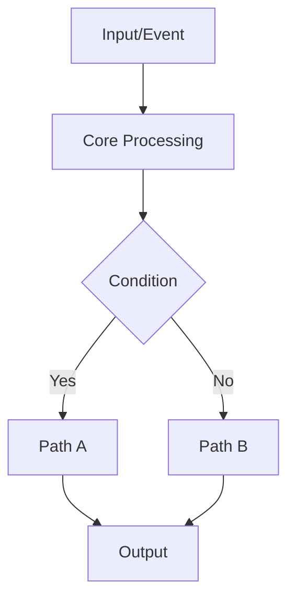

# Handoff Prompt Template

Use this template when generating the "Handoff Prompt (for agent)" section.

```markdown
You are a coding agent. Do not rewrite unrelated code. Implement only the scoped task.

## Goal
[Describe target outcome in 1-3 sentences.]

## Project Context
- Repository: [name/path]
- Runtime/Stack: [language, framework, key dependencies]
- Constraints: [performance, compatibility, style, security, deadline]

## Files To Modify
1. `[path/to/file]`: [what to change]
2. `[path/to/file]`: [what to change]

## Implementation Principles
- [Technical principle 1]
- [Technical principle 2]
- [Edge-case handling rule]

## Step-by-Step Plan
1. [Step]
2. [Step]
3. [Step]

## Expected Behavior After Change
- [Observable behavior 1]
- [Observable behavior 2]
- [Failure mode handling]

## Verification
Run:
```bash
[command 1]
[command 2]
```

Acceptance criteria:
- [Criterion 1]
- [Criterion 2]

## Non-Goals
- [Explicitly excluded change 1]
- [Explicitly excluded change 2]

## Output Required From You
1. Change summary (by file)
2. Why the solution works
3. Risks and follow-up suggestions
```

# Human Brief Template

Use this structure after the handoff prompt:

```markdown
## Human Brief
- Planned file changes:
  - `[path/to/file]`: [purpose]
- Core principle:
  - [high-level logic in plain language]
- Expected runtime result:
  - [what should be different to users/systems]
- Risks:
  - [main risk]
- Rollback:
  - [quick rollback method]
```

# Diagram Template (Mermaid)

Add this only when complexity is high:


