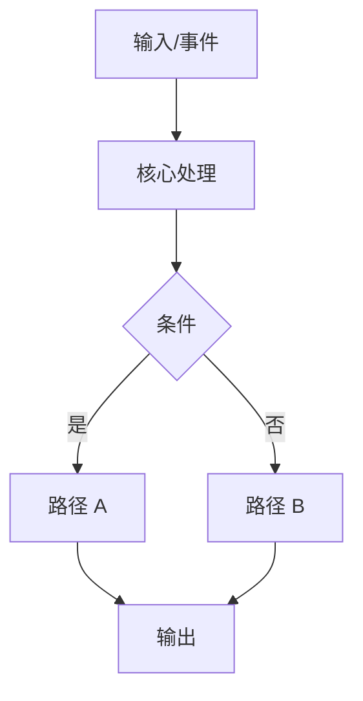

# 移交提示词模板

生成 "移交提示词 (给 Agent)" 部分时使用此模板。

```markdown
你是一个编码 Agent。不要重写无关的代码。仅实现范围内任务。

## 目标
[用 1-3 句话描述目标结果。]

## 项目上下文
- 仓库: [名称/路径]
- 运行时/栈: [语言, 框架, 关键依赖]
- 约束: [性能, 兼容性, 风格, 安全, 截止日期]

## 要修改的文件
1. `[文件路径]`: [改什么]
2. `[文件路径]`: [改什么]

## 实现原则
- [技术原则 1]
- [技术原则 2]
- [边缘情况处理规则]

## 分步计划
1. [步骤]
2. [步骤]
3. [步骤]

## 更改后的预期行为
- [可观察行为 1]
- [可观察行为 2]
- [故障模式处理]

## 验证
运行:
```bash
[命令 1]
[命令 2]
```

验收标准:
- [标准 1]
- [标准 2]

## 非目标
- [明确排除的更改 1]
- [明确排除的更改 2]

## 你需要输出的内容
1. 更改摘要 (按文件)
2. 解决方案为何有效
3. 风险和后续建议
```

# 深度技术简报模板

在移交提示词之后，请务必使用此结构为用户提供详细解释：

```markdown
## 深度技术简报

### 1. 变更摘要
- **涉及文件**:
  - `[文件路径]`: [修改目的]

### 2. 核心原理解析
> 这里是重点。请像导师一样解释技术细节。

- **技术背景**:
  - [解释相关的底层原理。例如：如果是内存安全问题，解释 Rust 的所有权机制如何防止此类错误；如果是网络问题，解释 TCP 握手或 HTTP 协议细节。]
- **为什么这样实现**:
  - [解释设计决策。例如：为了避免额外的内存拷贝，我们使用了引用传递而不是值传递。]
- **关键术语**:
  - **[术语1]**: [通俗解释]
  - **[术语2]**: [通俗解释]

### 3. 预期运行时结果
- [对用户可见的变化]
- [对系统内部状态的影响]

### 4. 风险与回滚
- **潜在风险**: [例如：性能回退、兼容性破坏]
- **回滚方案**: [如果出问题，如何快速恢复]
```

# 图表模板 (Mermaid)

仅在复杂度高时添加此项：


